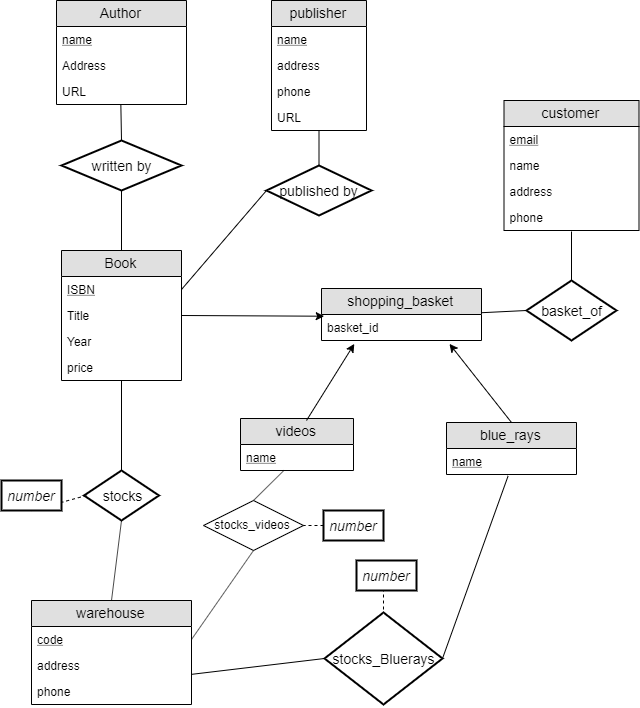
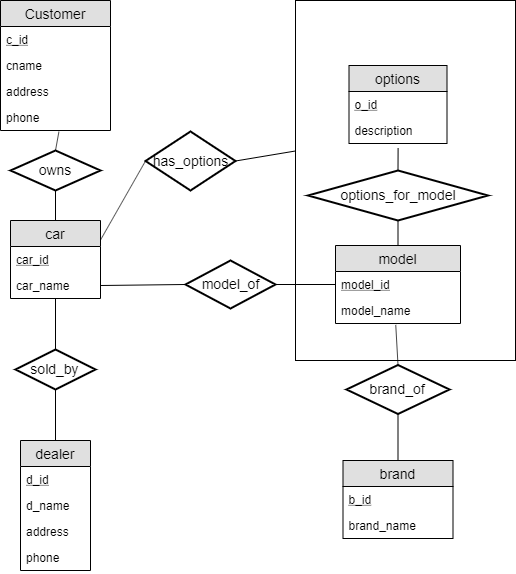

# Assignment 4 Joshua Kang 4331

## 7.20
### a.

author: name (primary key), address, URL

publisher: name (primary key), address, phone, URL

customer: email (primary key), name, address, phone

book: ISBN (primary key), title, year, price

warehouse: code (primary key), address, phone

shopping_basket: basket_id

### b. Extended ER Diagram without Generalization

### c. Extended ER Diagram with Generalization

## 7.21

