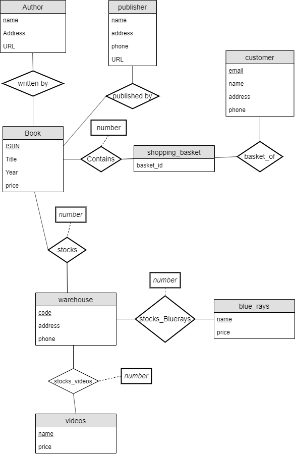

# Assignment 4 Joshua Kang 4331

## 7.20
### a.

author: name (primary key), address, URL

publisher: name (primary key), address, phone, URL

customer: email (primary key), name, address, phone

book: ISBN (primary key), title, year, price

warehouse: code (primary key), address, phone

shopping_basket: basket_id

### b. Extended ER Diagram without Generalization

### c. Extended ER Diagram with Generalization

### 7.20 Relation Schema for Part 2

#### Diagram

#### Constraints

Author: name is the primary key.

Book: ISBN is the primary key, Author is a FK referencing name in table author, warehouse is a
FK referencing code in table warehouse, Basket is a FK referencing basket_id in table
shopping_basket, Publisher is a FK referencing name in table publisher.

warehouse: code is the primary key.

videos: v_name is the primary key, basket is a FK referencing basket_id in table basket, 
warehouse is a FK referencing code in table warehouse.

blue_rays: blu_id is the primary key, basket is a FK referencing basket_id in table basket, 
warehouse is a FK referencing code in table warehouse.

shopping_basket: basket_id is the primary key.

customer: email is the primary key, basket is a FK referencing basket_id in table basket.

## 7.21

### ER Diagram

### 7.21 ER diagram description (Constraints)

#### Tables

customer: c_id (Primary Key), cname, address, phone

dealer: d_id (PK), d_name, address, phone

options: o_id (PK), description

model: model_id (PK), model_name

brand: b_id (PK), brand_name

#### Foreign Keys

##### b_id & model_id

b_id references b_id

model_id references model_id

##### model_id & o_id

model_id references model_id

o_id references o_id

##### c_id, d_id, model_id, & o_id

model_id references model_id

o_id references o_id

d_id references d_id

c_id references c_id

### 7.21 Relation Schema for Part 2

#### Diagram

#### Constraints

Customer: c_id is the PK and car_owned is a FK referencing car_id in table car.

car: car_id is the PK and model is a FK referencing model_id in table model, options is a FK referencing
o_id in table options, and dealer is a FK referencing d_id in table dealer.

model: model_id is the PK; brand is a FK referencing b_id in table brand and options
is a FK referencing o_id in table options.

options: o_id is the primary key.

Brand: b_id is the primary key.

dealer: d_id is the primary key.
