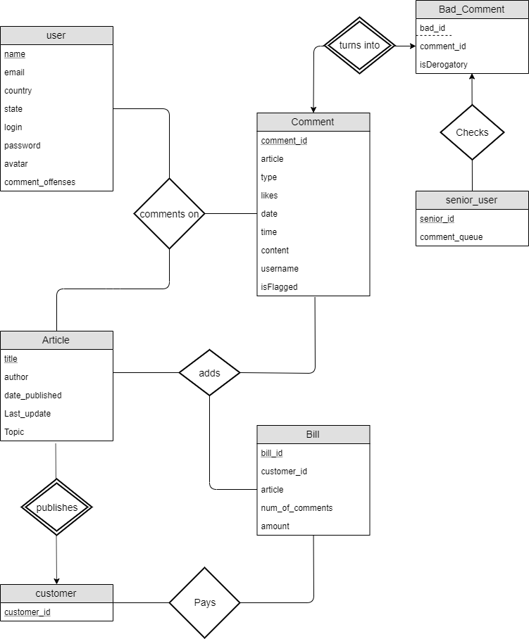
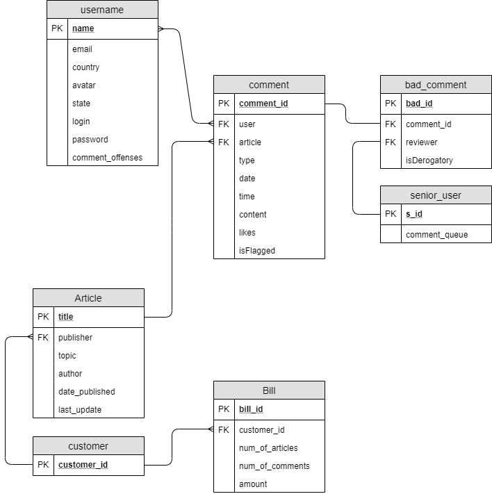
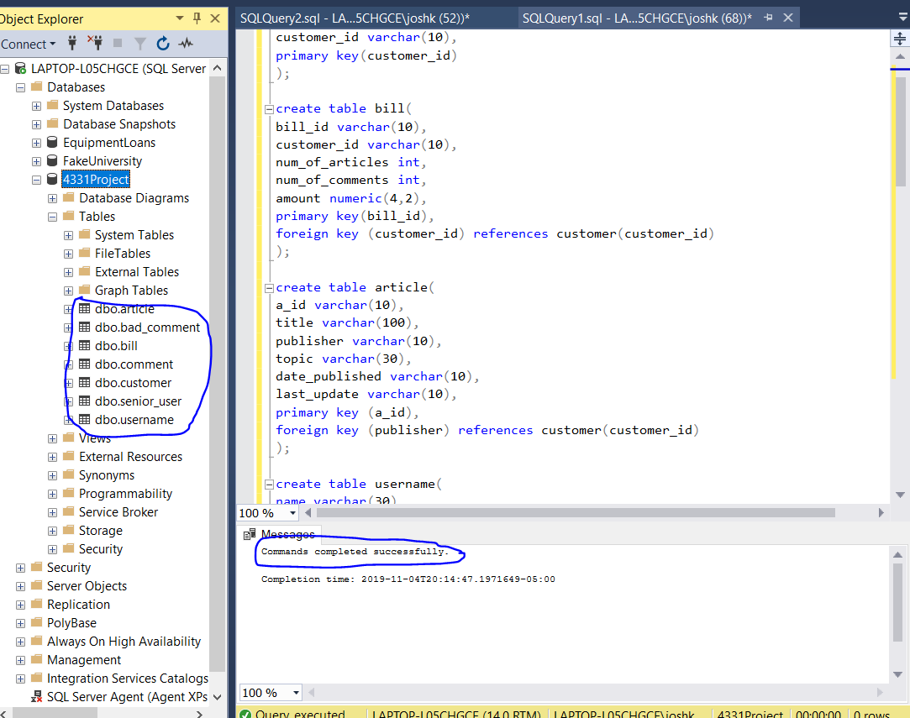

# Joshua Kang's 4331 Project

## Phase 1 Report

### ER Diagram

### Challenges I faced during this phase

A couple challenges I had during this phase was familiarizing myself with a certain notation for
the ER diagram. When looking up how to depict certain relations, I found many different notations for the
one to one, many to one, many to many, cardinalities and because there we're so many, I didn't know which one to use.
Another thing I had trouble understanding was whether there exists a one to many cardinality because for my process
I wanted one customer to output many articles and the arrow notation threw me off.

## Phase 2 Report 

### Relation Schema

### Query Screenshot

### Challenges I faced during Phase 2

I first wasn't sure how to set up my tables based on my ER diagrams but after
careful thinking I was able to see what kind of relations each of these tables should
have 